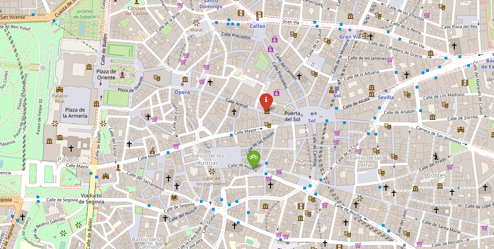
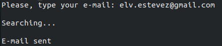
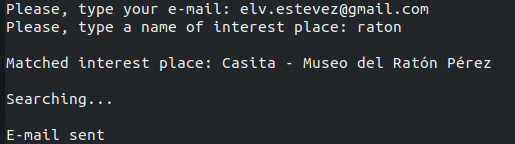

# bichiMAD - Data Analytics Ironhack module 1

bichiMAD find your closest available bike station in Madrid. Tour Madrid in a healthy, sustainable, traffic-free and cheap way.

- Choose to take or leave a bike.
- Enter your email address.
- Enter a place (to match the most approximate available place of interest).
- bichiMAD find your closest station to take or leave a bike (according to your choice).
- Receive an e-mail with the results in a map and excel with details info!

    You can also choose to find the closest station for every place. You will receive an e-mail with an excel attached with the points of interest and their closest available bike station.
    
> Available places: Museos de la ciudad de Madrid and Centros Culturales Municipales (incluyen Socioculturales y Juveniles) in [Portal de datos abiertos del Ayuntamiento de Madrid](https://datos.madrid.es/nuevoMadrid/swagger-ui-master-2.2.10/dist/index.html?url=/egobfiles/api.datos.madrid.es.json#/).



---

### **Technology stack**
Python, Pandas, Folium, REST API, SQL.

---

### **Configuration**
Get project from GitHub and create a python environment with these additional libraries:
- pandas
- sqlalchemy
- requests
- geopandas
- shapely
- fuzzywuzzy
- python-levenshtein
- folium
- python-dotenv
- uliplot

> Review Requeriments.txt file.

Create .env file with secret data

    DATABASE_PASSWORD
    API_CLIENTID
    API_PASSKEY
    EMAIL_SENDER
    EMAIL_PASSWORD

---

### **Usage**
To run the application you have to open in a terminal the file bichiMAD.py. Two arguments:

- Option. Choose specific place or every place.

    - "1" get closest BiciMAD for every place of interest. 
    - "2" get closest BiciMAD for a place of interest.

- Action. Choose take or leave a bike.
    - "T" take a bike. 
    - "L" leave a bike.

The process ask for your e-mail address and place of interest. 

Example:

`bichiMAD.py -o 1 -a T`



`bichiMAD.py -o 2 -a L`



---

### **Folder structure**

```
└── project
    ├── .gitignore
    ├── .env
    ├── Requeriments.txt
    ├── README.md
    ├── bichiMAD.py
    ├── modules
    │   ├── data_bicimad.py
    │   ├── data_mad.py
    │   ├── find_bicimad.py
    │   ├── match_place.py
    │   ├── geo_calculations.py
    │   ├── file_results.py
    │   ├── to_email.py
    ├── img
    └── data
        └── results    
```

---

### **ToDo**
Extend to another places in [Portal de datos abiertos del Ayuntamiento de Madrid](https://datos.madrid.es/nuevoMadrid/swagger-ui-master-2.2.10/dist/index.html?url=/egobfiles/api.datos.madrid.es.json#/).

Calculate walking distance (now is straight-line distance).

Improve the quality of e-mail response.

Apply a front-end layer.
